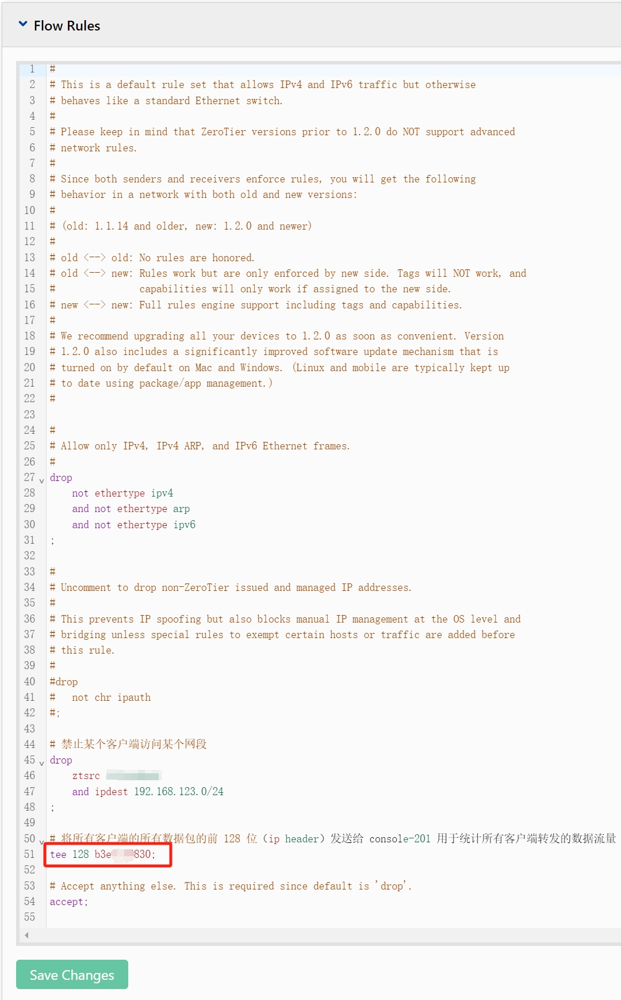

**简介:**

根据[维基百科关于IPv4的描述](https://en.wikipedia.org/wiki/IPv4#Header)，每个 IP 数据包的前 128 位包含了该包的元数据，包括数据包的总大小。利用这些数据，可以在 ZeroTier 网络中实现客户端流量统计。

**在 ZeroTier 控制台设置流量规则:**

按照[ZeroTier官方文档](https://docs.zerotier.com/rules/#traffic-observation-and-interception)中的描述，在控制台 `Flow Rules` 部分定义规则，将所有客户端的数据包的前 128 位发送到指定的 ZeroTier 节点。




**程序执行:**

在指定的 ZeroTier 节点上运行此程序，该程序负责读取和分析 ZeroTier 网络界面的数据包，解析包括源地址、目标地址和数据包大小的信息。此数据可转换为 Prometheus 可收集的指标，通过 `addr` 标签可以确定具体的 ZeroTier 客户端。

程序依赖 libpcap 库文件，debian/ubuntu 可以通过 `apt-get install libpcap-dev` 安装。

**命令行参数:**

| 参数                   | 描述                         | 默认值                                             |
|-----------------------|------------------------------|---------------------------------------------------|
| `--listen-address`    | 指标服务器侦听的端口号       | `:9123`                                           |
| `--zerotier-device`   | ZeroTier 网络卡名称          | 首个以 "zt" 或 "ZeroTier" 开头的网络卡名称         |

**指标样例**

```
# HELP zerotier_host_received_bytes_total zerotier_host_received_bytes_total
# TYPE zerotier_host_received_bytes_total counter
zerotier_host_received_bytes_total{addr="192.168.124.251"} 6.283878e+06
zerotier_host_received_bytes_total{addr="192.168.124.252"} 1346
zerotier_host_received_bytes_total{addr="192.168.124.253"} 1.99582121e+08
# HELP zerotier_host_sent_bytes_total zerotier_host_sent_bytes_total
# TYPE zerotier_host_sent_bytes_total counter
zerotier_host_sent_bytes_total{addr="192.168.124.251"} 1.99583467e+08
zerotier_host_sent_bytes_total{addr="192.168.124.252"} 1260
zerotier_host_sent_bytes_total{addr="192.168.124.253"} 6.282618e+06
```

---

**Introduction:**

According to the [Wikipedia description of IPv4](https://en.wikipedia.org/wiki/IPv4#Header), the first 128 bits of each IP packet contain metadata about the packet, including its total size. Using this data, it is possible to implement client traffic statistics in a ZeroTier network.

**Setting Up Flow Rules in the ZeroTier Console:**

As per the [ZeroTier documentation](https://docs.zerotier.com/rules/#traffic-observation-and-interception), define rules in the `Flow Rules` section on zerotier console web page to send the first 128 bits of all client packets to a designated ZeroTier node.


**Program Execution:**

Run this program on the designated ZeroTier node, which is responsible for reading and analyzing the packets on the ZeroTier network interface. The program parses the source and destination addresses and the size of the packets. This data can be converted into metrics collectible by Prometheus, with the `addr` label identifying specific ZeroTier clients.

The program depends on the libpcap library. For Debian/Ubuntu systems, you can install it using the command `apt-get install libpcap-dev`.

**Command-line Parameters:**

| Parameter            | Description                        | Default Value                                     |
|----------------------|------------------------------------|---------------------------------------------------|
| `--listen-address`   | Port number the metrics server listens on | `:9123`                                          |
| `--zerotier-device`  | Name of the ZeroTier network device | The first network device name starting with "zt" or "ZeroTier" |

**Metric Examples:**

```
# HELP zerotier_host_received_bytes_total zerotier_host_received_bytes_total
# TYPE zerotier_host_received_bytes_total counter
zerotier_host_received_bytes_total{addr="192.168.124.251"} 6.283878e+06
zerotier_host_received_bytes_total{addr="192.168.124.252"} 1346
zerotier_host_received_bytes_total{addr="192.168.124.253"} 1.99582121e+08
# HELP zerotier_host_sent_bytes_total zerotier_host_sent_bytes_total
# TYPE zerotier_host_sent_bytes_total counter
zerotier_host_sent_bytes_total{addr="192.168.124.251"} 1.99583467e+08
zerotier_host_sent_bytes_total{addr="192.168.124.252"} 1260
zerotier_host_sent_bytes_total{addr="192.168.124.253"} 6.282618e+06
```